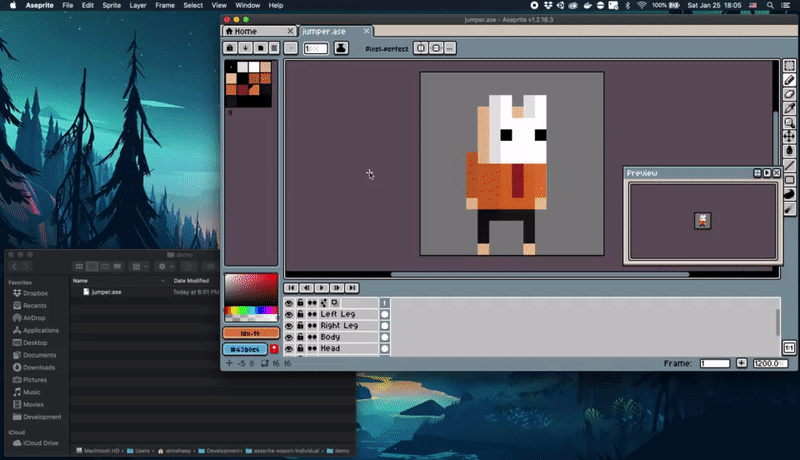
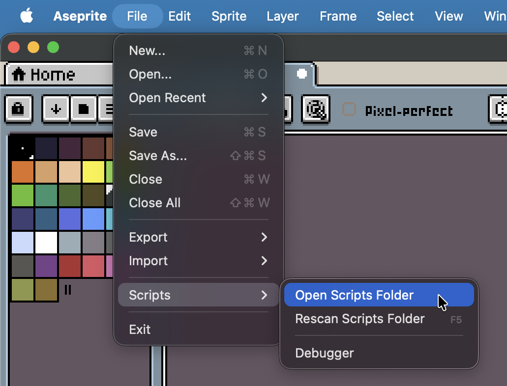

# Aseprite: "Export Individual"
Aseprite scripts to export layers as individual sprites.

# How to install
Copy the file `export-layers.lua` from this repository to the Aseprite's scripts folder.

To access the scripts folder, go in Aseprite's menu then in `File -> Scripts -> Open Scripts Folder`.

Once the script is copied in this directory, restart Aseprite to make it appear in the `File -> Scripts` sub-menu.
