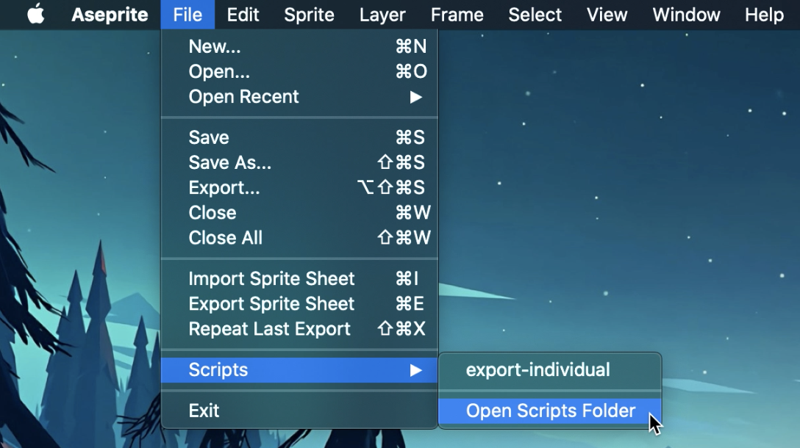

# Aseprite Export Layers

[Aseprite](https://aseprite.org/) script to export each layer of your sprite as individual images.  

## Installation

1. **Download the script**
   [Download the latest version of `export-layers.lua`](https://raw.githubusercontent.com/quantumsheep/aseprite-export-layers/refs/heads/master/export-layers.lua).

2. **Open Aseprite’s Scripts Folder**  
   In Aseprite, go to:  
   **`File → Scripts → Open Scripts Folder`**

   

3. **Copy the script**  
   Place `export-layers.lua` into the folder that opened.

4. **Restart Aseprite**  
   After restarting, the script will appear under:  
   **`File → Scripts → Rescan Scripts Folder`**
